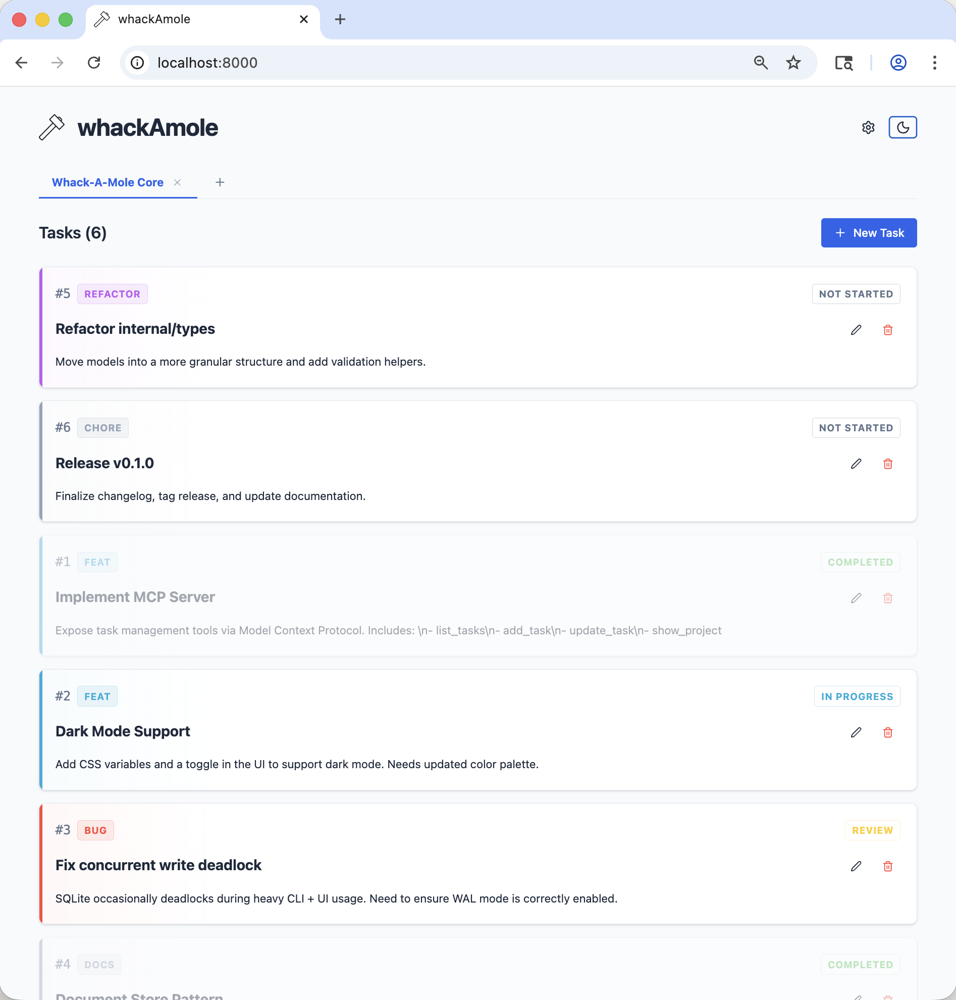

# 🔨 whackAmole

**Squash bugs and hammer down tasks with a coordinated team of agents.**

[](https://go.dev/)
[](https://opensource.org/licenses/MIT)

<p align="center">
  <picture>
    <source media="(prefers-color-scheme: dark)" srcset="docs/whack-ui-dark.png">
    <source media="(prefers-color-scheme: light)" srcset="docs/whack-ui-light.png">
    
  </picture>
</p>

`whackAmole` is a local-first, agent-native task manager. It bridges the gap between AI-driven development and human oversight, providing a structured way for agents to propose work and for humans to refine it.

## 🔄 The AI-Human Loop

1.  **Agent Proposes**: An AI agent (via MCP) analyzes your codebase and breaks a feature down into actionable tasks.
2.  **Human Refines**: You use the **Web UI** to review descriptions, adjust priorities, or merge tasks.
3.  **Agent Executes**: The agent picks up the "Not Started" tasks one by one, moving them to "In Progress" and finally "Review" for your approval.

---

## ✨ Features

- **Web UI**: a polished interface with dark mode support and a rich Markdown editor.
- **Agent-Ready**: native **Model Context Protocol (MCP)** server for seamless integration with Claude, ChatGPT, and other MCP-compatible clients.
- **CLI-First**: a fast Go binary (`whack`) for terminal-native workflows and automation.
- **Zero-Config Persistence**: uses SQLite (CGO-free) and embedded migrations. No external database required.

---

## 🚀 Installation

Quickly install the latest pre-built binary for your platform.

```bash
curl -sSL https://raw.githubusercontent.com/gosusnp/whackamole/main/install.sh | sh
```

---

## 🛠️ Quick Start

### 1. Initialize a Project
```bash
whack project add "My App" --key myapp
whack config set-local project myapp  # writes .whackamole.yaml in the current directory, scoping this project to the repo
```

### 2. Manage via CLI
```bash
whack task add "Fix login bug" --type bug --desc "Fails on empty password"
whack task list
```

### 3. Launch the UI
```bash
whack ui             # opens at http://localhost:8080
whack ui --port 9000 # use a different port
```

---

## 🤖 Agent Configuration

`whackAmole` exposes a standard MCP server (`whack mcp`). Any MCP-compatible client can connect using `command: whack` and `args: ["mcp"]`.

**Claude Desktop** (`claude_desktop_config.json`):

```json
{
  "mcpServers": {
    "whackamole": {
      "command": "whack",
      "args": ["mcp"]
    }
  }
}
```

Other clients (Cursor, Continue, etc.) follow the same `command`/`args` pattern — consult your client's MCP documentation for the exact config format.

---

## 📖 Documentation

- [Architecture Overview](docs/architecture.md) - How data validation and persistence work.
- [Frontend Guide](docs/frontend.md) - Details on the Preact + Vite setup.

## 📄 License
MIT
